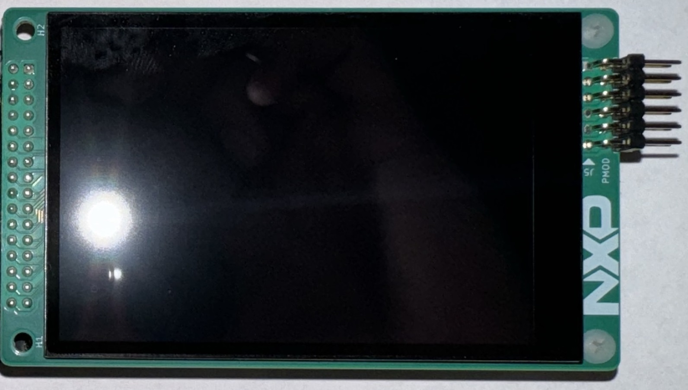
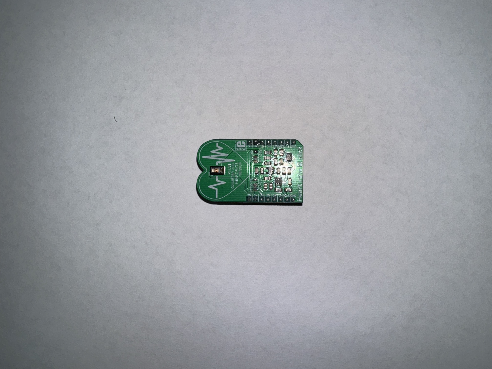
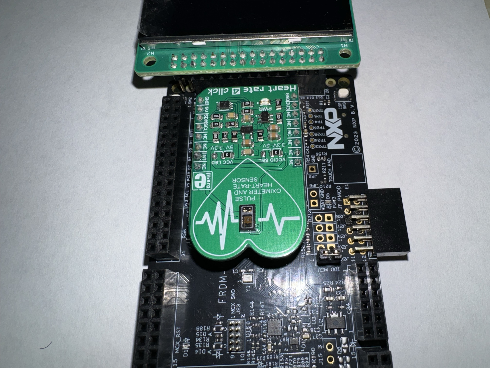
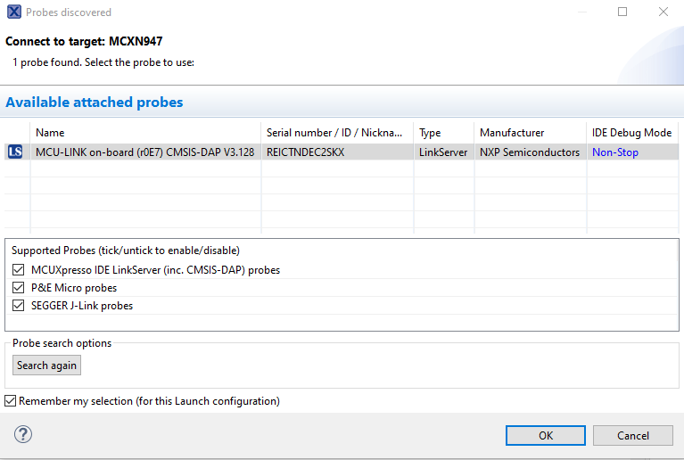
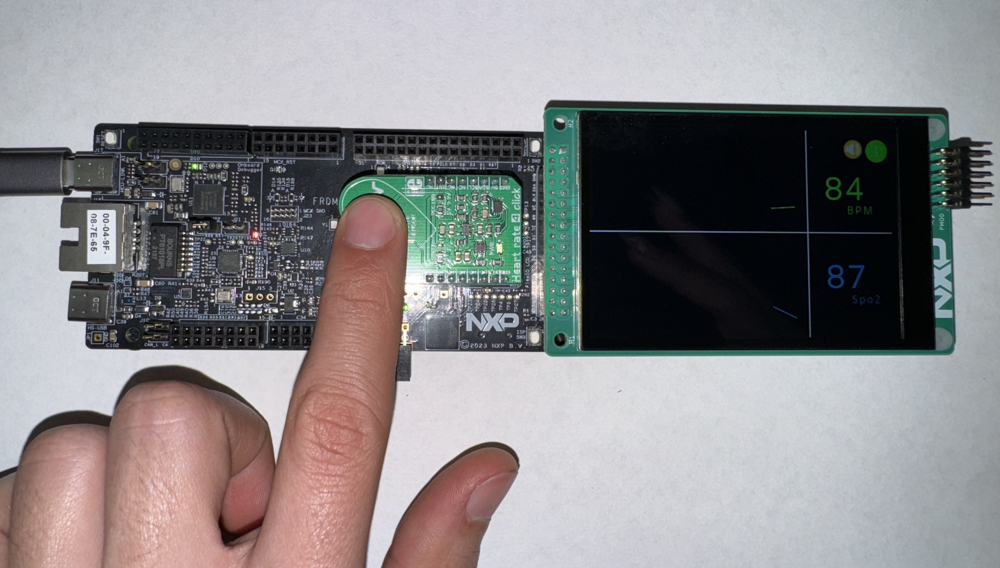

# NXP Application Code Hub

## Vital Health Signal Monitor with display in MCXN9
*The demo emulates a vital sign monitor, uses a pulse-oximeter sensor that take the Spo2 value and the BPM.*

*The demo uses the LVGL graphics framework and use an LCD with a resolution of 480x320. In the display we can see the graphic of the values and the measure of the BPM value and the Spo2%.*

#### Boards: FRDM-MCXN947
#### Categories: Graphics, HMI, Sensor
#### Peripherals: DISPLAY, DMA, I2C
#### Toolchains: MCUXpresso IDE

## Table of Contents
1. [Software](#step1)
2. [Hardware](#step2)
3. [Setup](#step3)
4. [Results](#step4)
5. [FAQs](#step5) 
6. [Support](#step6)
7. [Release Notes](#step7)

## 1. Software
*This software was developed in MCUXpresso IDE, this demo is in baremetal but have integrated the LVGL graphics library that uses an internal rtos to manage the LCD image and the Touch, for the heart rate sensor we have an interuption that sample the signal every 20us, the sensor library make a filtration of the values and return a graphable value, after that we take the values and we use it to display de graphic. The application start when the user put the finger in the sensor, after that you can see a message in the display that indicate that the measurment start, afert a few seconds the graph appear. https://nxp.com/mcuxpresso.*

## 2. Hardware
*For this demo you will need the next hardware.*

- [MCX N9 FRD Boad.](https://nxp.com/FRDM-MCXN947.com)

- [Low Cost NXP LCD.](https://nxp.com/nxp.com/LCD-PAR-S035.com) 

- [MicroE PulseOximeter Sensor.](https://www.mikroe.com/heart-rate-4-click) 

## 3. Setup

### 3.1 Step 1 

*For the LCD Conection first you need to check the SW1 in the LCD the position of the switch should be 010 (16bits 8080) the next step is plugging the LCD in the board (use the next image like reference) you should connect the LCD in the J8 header with two pins free in the top of the header.*

### 3.2 Step 2 
*For the sensor you need to connect it in the MicroE header like the next image.*

### 3.3 Step 3
*After cloning the repository and importing it to the workspace connect the board to the pc using a USB cable in the J17 header.*

*Use the button debug to build and compile the project, select the target and push play to run the application.*

## 4. Results
*To start a measure you need to put your finger in the sensor and a warning mensage will appear in the LCD, after a few seconds the measure calibrations ends and the values are showed in the LCD.*

## 6. Support

#### Project Metadata
<!----- Boards ----->

<!----- Categories ----->
  

<!----- Peripherals ----->
  

<!----- Toolchains ----->

Questions regarding the content/correctness of this example can be entered as Issues within this GitHub repository.

>**Warning**: For more general technical questions regarding NXP Microcontrollers and the difference in expected funcionality, enter your questions on the [NXP Community Forum](https://community.nxp.com/)

## 7. Release Notes
| Version | Description / Update                           | Date                        |
|:-------:|------------------------------------------------|----------------------------:|
| 1.0     | Initial release on Application Code Hub        | January 4th 2024 |

